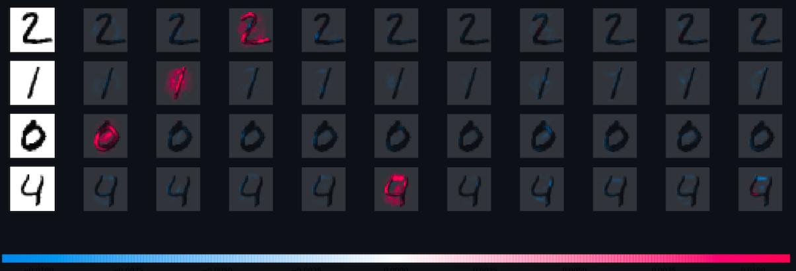
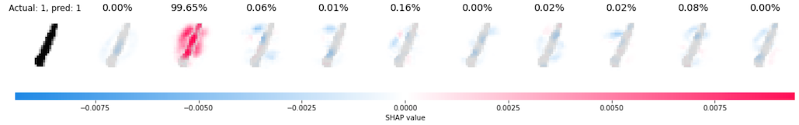
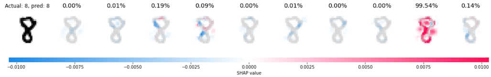
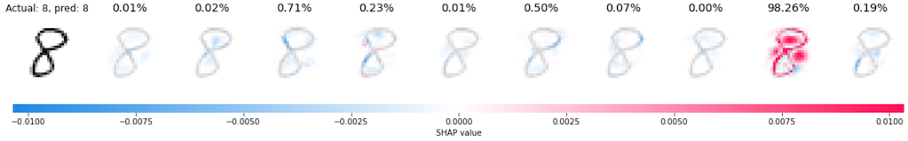
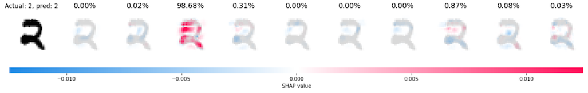
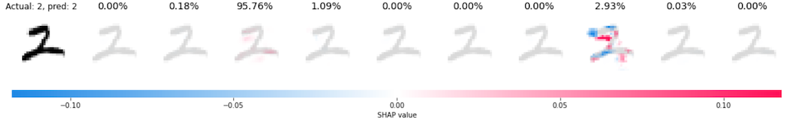
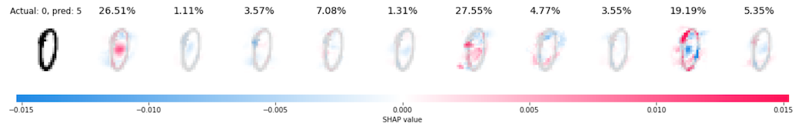
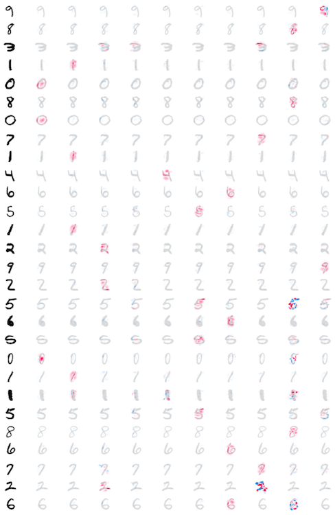
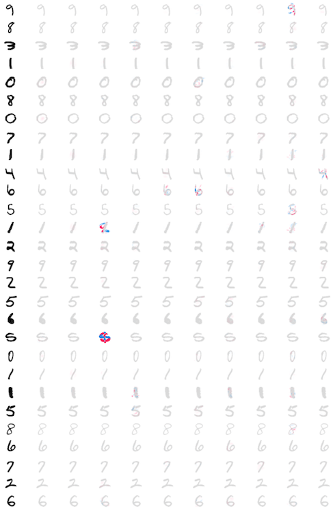

# Experiments with SHAP and image classification

This repository explores how to interpret predictions of an image classification neural network using [SHAP (SHapley Additive exPlanations)](https://arxiv.org/abs/1705.07874).

The goals of the experiments are to:

1. Explore how SHAP explains the predictions. This experiment uses a (fairly) accurate network to understand how SHAP attributes the predictions.
1. Explore how SHAP behaves with inaccurate predictions. This experiment uses a network with lower accuracy and prediction probabilities that are less robust (more spread among the classes) to understand how SHAP behaves when the predictions are not reliable (a hat tip to [Dr. Rudin's work](https://arxiv.org/abs/1811.10154)).

## Why use SHAP instead of another method?

This is my first opportunity to delve into model interpretability down to the code level. I picked [SHAP (SHapley Additive exPlanations)](https://arxiv.org/abs/1705.07874) to get started because of [its promise to unify various methods](https://github.com/slundberg/shap#methods-unified-by-shap) (emphasis ours):

> ...various methods have recently been proposed to help users interpret the predictions of complex models, but it is often unclear how these methods are related and when one method is preferable over another. To address this problem, **we present a unified framework for interpreting predictions**, SHAP (SHapley Additive exPlanations). SHAP assigns each feature an importance value for a particular prediction. Its novel components include: (1) the identification of a new class of additive feature importance measures. ... The new class unifies six existing methods, ...

## Overview of SHAP feature attribution for image classification

### How SHAP works

SHAP is based on [Shapley value](https://en.wikipedia.org/wiki/Shapley_value), a method to calculate the contributions of each player to the outcome of a game. In the case of machine learning, the "players" are the features (e.g. pixels in an image) and the "outcome of a game" is the model's prediction. [This article by Samuelle Mazzanti](https://towardsdatascience.com/shap-explained-the-way-i-wish-someone-explained-it-to-me-ab81cc69ef30) explains with a simple case how to calculate the Shapley value. It's a good introduction to understand the mechanics of the process.

The Shapley value is calculated with all possible combinations of players. Given N players, it has to calculate outcomes for 2^N combinations. This is not feasible for large numbers of N. For example, for images N is the number of pixels.

SHAP does not attempt to calculate the actual Shapley value. Instead, it uses sampling and approximations to calculate the SHAP value. See [chapter 4 of the SHAP paper for details](https://arxiv.org/abs/1705.07874).

### Visualizing SHAP attributions

SHAP uses colors to explain attributions:

- Red pixels increases the probability of a class being predicted
- Blue pixels decrease the probability of a class being predicted

The following picture and text come from the [SHAP README](https://github.com/slundberg/shap#deep-learning-example-with-deepexplainer-tensorflowkeras-models).



> The plot above explains ten outputs (digits 0-9) for four different images. Red pixels increase the model's output while blue pixels decrease the output. The input images are shown on the left, and as nearly transparent grayscale backings behind each explanations. The sum of the SHAP values equals the difference between the expected model output (averaged over the background dataset) and the current model output. Note that for the 'zero' image the blank middle is important, while for the 'four' image the lack of a connection on top makes it a four instead of a nine.

This is an important part of the explanation: _"Note that for the 'zero' image the blank middle is important, while for the 'four' image the lack of a connection on top makes it a four instead of a nine."_ In other words, it's not only what is present that is important to decide what digit an image is, but also ***what is absent***.

## Experiments

This [Jupyter notebook](https://github.com/fau-masters-collected-works-cgarbin/shap-experiments-image-classification/blob/master/shap-experiments-image-classification.ipynb) shows how to use SHAP's DeepExplainer to visualize feature attribution in image classification with neural networks. See the [instructions to run the code](./running-the-code.md) for more details.

SHAP has multiple explainers. The notebook uses the DeepExplainer explainer because it is the one used in [the image classification SHAP sample code](https://shap.readthedocs.io/en/latest/image_examples.html).

The code is based on the [SHAP MNIST example](https://shap.readthedocs.io/en/stable/example_notebooks/image_examples/image_classification/PyTorch%20Deep%20Explainer%20MNIST%20example.html), available as a Jupyter notebook [on GitHub](https://github.com/slundberg/shap/blob/master/notebooks/image_examples/image_classification/PyTorch%20Deep%20Explainer%20MNIST%20example.ipynb). This notebook uses the PyTorch sample code because at this time (April 2021), SHAP does not support TensorFlow 2.0. [This GitHub issue](https://github.com/slundberg/shap/issues/850) tracks the work to support TensorFlow 2.0 in SHAP.

The experiments are as follows:

1. Train a CNN to classify the MNIST dataset.
1. Show the feature attributions for a subset of the training set using SHAP DeepExplainer.
1. Review and annotate some of the attributions to understand better what they reveal about the model and about the explanation itself.
1. Repeat the steps above with the CNN that is significantly less accurate.

### An important caveat

> _Explanations must be wrong._ -- [Stop Explaining Black Box Machine Learning Models for High Stakes Decisions and Use Interpretable Models Instead](https://arxiv.org/abs/1811.10154), Cynthia Rudin

As we are going through the exploration of the feature attributions, we must keep in my mind that we are analyzing two items at the same time:

1. What the model predicted.
1. How the feature attribution explainer _approximates_ what the model considers to make the prediction.

The explainer is an approximation of the model and sometimes (as in this case) also uses an approximation of the input. Therefore, some of the attributions that may not make much sense may be a result of these approximations, not necessarily of the model's behavior.

## Some results from the experiments

This section explores some of the feature attributions resulting from the experiments (see the [notebook](https://github.com/fau-masters-collected-works-cgarbin/shap-experiments-image-classification/blob/master/shap-experiments-image-classification.ipynb)).

Before reading further: this is my first foray into the details of feature attribution with SHAP (or any other method). Some of the items reported below are questions I need to investigate further to understand better how feature attribution in general, and SHAP in particular, work.

Some candidates for research questions are noted in the explanations.

### Accurate network

This section explores the feature attribution using the (fairly) accurate network. This network achieves 97% overall accuracy.

Each picture below shows these pieces of information:

- The leftmost digit is the example from the MNIST dataset that the network predicted. The text at the top of the picture shows the actual and predicted values. The predicted value is the largest of all probabilities (without applying a threshold).
- Following that digit, there are ten digits, one for each class (from left to right: zero to nine), with the feature attributions overlaid on each digit. The text at the top shows the probability that the network assigned for that class.

Some of the feature attributions are easy to interpret. For example, this is the attribution for a digit "1".



We can see that the presence of the vertical pixels at the center of the image increases the probability of predicting a digit "1", as we would expect. The absence of pixels around that vertical line also increases the probability.

The two examples for the digit "8" below are also easy to interpret. We can see that the blank space in the top loop and the blank spaces on both sides of the middle part of the image are important to define an "8".





In the two examples for the digit "2" below, on the other hand, the first one is easy to interpret, but the attributions for the second make less sense. While reviewing them, note that the scale for the SHAP values is different for each example. The range of values in the second example is an order of magnitude larger. It does not affect a comparative analysis, but may be important in other cases to note the scale before judging the attributions.

In the first example we can see which pixels are more relevant (red) to predict the digit "2". We can also see what pixels were used to reduce the probability of predicting the digit "7" (blue), the second-highest predicted probability.

In the second picture, the more salient attributions are on the second-highest probability, the digit "7". It's almost as if the network "worked harder" to reject that digit than to predict the digit "2". Although the probability of the digit "7" is higher in this second example (compared to the digit "7" in the first example), it's still far away from the probability assigned to the digit "2".

**RESEARCH QUESTION 1**: What causes SHAP to sometimes highlight the attributions of a class that was not assigned the highest probability?





### Inaccurate network

This section explores the feature attribution using the inaccurate network. This network achieves 87% overall accuracy. Besides the low overall accuracy, each prediction also has a larger spread of probabilities. The difference between the largest and the second-largest probability in some cases is very small, as we will soon see.

In the example for the digit "0" below, the network incorrectly predicted it as "5". But it didn't miss by much. The difference in probability between "5" (incorrect) and "0" (correct) is barely 1%. Also, the two probabilities add up to 54%. In other words, the two top probabilities add up to about half of the total probability. The prediction for this example is not only wrong but uncertain across several classes (labels).

SHAP still does what we ask: shows the feature attributions for each class. For the three classes with the highest probability, we can see that:

- Digit "0": The empty middle is the important part, as we have seen in other cases for this digit.
- Digit "8": The top and bottom parts look like the top and bottom loops of the digit "8", resulting in the red areas we see in the attribution. The empty middle is now a detractor for this class (blue). An actual digit "8" would have something here, where the bottom and top loops meet.
- Digit "5": Left this one for last because it is the one with the highest probability (but not by much) and also the one hardest to explain. It is almost as if just a few pixels (in red) were enough to assign a probability higher than the correct digit "0".



This example shows an important concept about explanations for black-box models: they explain what the model is predicting, but they do not attempt to explain if the predictions are correct.

Hence the call to [stop explaining black-box models](https://arxiv.org/abs/1811.10154) (at least for some applications). But this is a story for another day...

### Aggregate attributions for accurate vs. inaccurate networks

Instead of plotting attributions one by one, as we saw in the previous examples, SHAP can also plot multiple images in the same plot. One advantage of this plot is that all images share the same SHAP scale.

The plots below show all the attributions for all test digits. The accurate network is on the left and the inaccurate network is on the right.

In the plot for the accurate network we can see that all samples have at least one class (digit) with favorable attributions (red). The plot is dotted with red areas. In the inaccurate network we don't see the same pattern. The plot is mainly gray.

**RESEARCH QUESTION 2**: Given this pattern, is it possible to use the distribution of attributions across samples to determine if a network is accurate (or not)? In other words, if all we have is the feature attributions for a reasonable number of cases, but don't have the actual vs. predicted labels, could we use that to determine that a network is accurate (or not)?

| Accurate                              | Inaccurate                                |
| ------------------------------------- | ----------------------------------------- |
|  |  |

## Limitations of these experiments

SHAP attributes features based on a baseline input. This is this line of code in the Jupyter notebook:

```python
expl = shap.DeepExplainer(model, background_images)
```

The baseline images are extracted from the test set here:

```python
images, targets = next(iter(m.test_loader))
...
BACKGROUND_SIZE = 100
background_images = images[:BACKGROUND_SIZE]
```

The choice of baseline images can significantly affect the SHAP results (the results of any method that relies on baseline images, to be precise), as demonstrated in [Visualizing the Impact of Feature Attribution Baseline](https://distill.pub/2020/attribution-baselines/).

In the experiments we conducted here we used a relatively small set of images for the baseline and we didn't attempt to get an equal distribution of the digits in that baseline (other than a simple manual check of distributions - see the notebook).

**RESEARCH QUESTION 3**: Would a larger number of baseline images, with equal distribution of digits, significantly affect the results? More generically, what is a reasonable number of baseline images to start trusting the results?

## Code

See instructions [here](./running-the-code.md) to prepare the environment and run the code.
