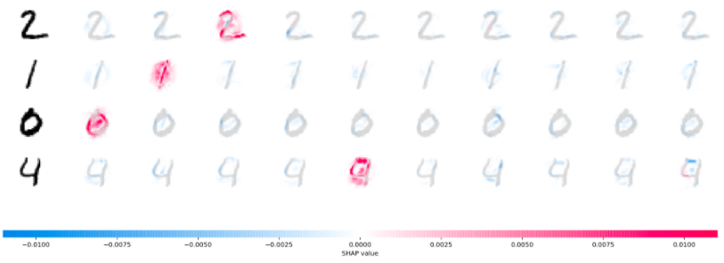

# Experiments with SHAP and image classification

This repository explores how to interpret predictions of an image classification neural network using [SHAP](https://arxiv.org/abs/1705.07874).

The goals of the experiments are to:

1. Explore how SHAP explain the predictions. This experiment uses a (fairly) accurate network to understand how SHAP attributes the predictions.
1. Explore how SHAP behaves with innacurate predictions. This experiment uses a network with lower accuracy and prediction probabilities that are less robust (more spread among the classes) to understand how SHAP behaves when the predicitons are not reliable (a hat tip to [Dr. Rudin's work](https://arxiv.org/abs/1811.10154)).

SHAP has multiple explainers. The code uses the DeepExplainer explainer because it is the one used in the [image classification SHAP sample code](https://shap.readthedocs.io/en/latest/image_examples.html).

The code is based on the [SHAP MNIST example](https://shap.readthedocs.io/en/stable/example_notebooks/image_examples/image_classification/PyTorch%20Deep%20Explainer%20MNIST%20example.html), available as a Jupyter notebook [on GitHub](https://github.com/slundberg/shap/blob/master/notebooks/image_examples/image_classification/PyTorch%20Deep%20Explainer%20MNIST%20example.ipynb). This notebook uses the PyTorch sample code because at this time (April 2021), SHAP does not support TensorFlow 2.0. [This GitHub issue](https://github.com/slundberg/shap/issues/850) tracks the work to support TensorFlow 2.0 in SHAP.

The code for the experiments is [on this Jupyter notebook](https://github.com/fau-masters-collected-works-cgarbin/shap-experiments-image-classification/blob/master/shap-experiments-image-classification.ipynb). See the [instructions to run the code](./running-the-code.md) for more details.

## Interpreting SHAP feature attribution

SHAP uses colors to explain feature attributions:

- Red pixels increases the probability of a class being predicted
- Blue pixels decrease the probability of a class being predicted

The following picture and text come from the [SHAP README](https://github.com/slundberg/shap#deep-learning-example-with-deepexplainer-tensorflowkeras-models).

> The plot above explains ten outputs (digits 0-9) for four different images. Red pixels increase the model's output while blue pixels decrease the output. The input images are shown on the left, and as nearly transparent grayscale backings behind each of the explanations. The sum of the SHAP values equals the difference between the expected model output (averaged over the background dataset) and the current model output. Note that for the 'zero' image the blank middle is important, while for the 'four' image the lack of a connection on top makes it a four instead of a nine.

This is an important part of the explanation: _"Note that for the 'zero' image the blank middle is important, while for the 'four' image the lack of a connection on top makes it a four instead of a nine."_ In other words, it's not only what is present that is important to decide what digit an image is, but also ***what is absent***.

## Some results from the experiments

This section explores some of the feature attributions resulting from the experiments (see the [notebook](https://github.com/fau-masters-collected-works-cgarbin/shap-experiments-image-classification/blob/master/shap-experiments-image-classification.ipynb)).

Before reading further: this is my first foray into the details of feature attribution with SHAP (or any other method). Some of the items reported below are questions I need to investigate further to understand better how feature attribution in general, and SHAP in particular, work.

Some candidates for research questions are noted in the explanations.

### Accurate network

This section explores the feature attribution using the (fairly) accurate network. This network achieves 97% overal accuracy.

Each picture below shows these pieces of information:

- The leftmost digit is the example from the MNIST dataset that the network predicted. The text at the top of the picture shows the actual and predicted values. The predicted value is the largest of all probabilities (without applying a threshold).
- Following that digit, there are ten digits, one for each class (from left to right: zero to nine), with the feature attributions overlaid on each digit. The text at the top shows the probability the network assigned for that class.

Some of the feature attributions are easy to interpret. For example, this is the attribution for a digit "1".

We can see that the presence of the vertical pixels at the center of the image increase the probability of predicting a digit "1", as we would expect. The absence of pixels around that vertical line also increase the probability.

The two examples for the digit "8" below are also easy to interpret. We can see that the blank space in the top loop and the blank spaces on both sides of the middle part of the image are important to define a "8".

In the two examples for the digit "2" below, on the other hand, the first one is easy to interpret, but the attributions for the second make less sense. While reviewing them, note that the scale for the SHAP values is different for each example. The range of values in the second example is an order of magnitude larger. It does not affect a comparative analysis, but may be important in other cases to note the scale before judging the attributions.

In the first example we can see which pixels are more relevant (red) to predict the digit "2". We can also see what pixels were used to reduce the probability of predicting the digit "7" (blue), the second-highest predicted probability.

In the second picture, the more salient attributions are on the second-highest probability, the digit "7". It's almost as if the network "worked harder" to reject that digit than to predict the digit "2". Although the probability of the digit "7" is higher in this second example (compared to the digit "7" in the first example), it's still far away from the probability assigned to the digit "2".

**RESEARCH QUESTION 1**: What causes SHAP to sometimes to highlight the attributions of a class that was not assigned the highest probability?

### Inaccurate network

This section explores the feature attribution using the inaccurate network. This network achieves 87% overall accuracy. Besides the low overall accuracy, each prediction also has a larger spread of probabilities. The difference between the largest and the second-largest probabiliy in some cases is very small, as we will soon see.

In the example for the digit "0" below, the network incorrectly predicted it as "5". But it didn't miss by much. The difference in probability between "5" (incorrect) and "0" (correct) is barely 1%. Also, the two probabilities add up to 54%. In other words, the two top probabilities add up to about half of the total probability. The prediction for this example is not only wrong, but uncertain accross several classes (labels).

SHAP still does what we ask: shows the feature attributions for each class. For the three classes with the highest probability, we can see that:

- Digit "0": The empty middle is the important part, as we have seen in other cases for this digit.
- Digit "8": The top and bottom parts look like the top and bottom loops of the digit "8", resulting the red areas we see in the attribution. The empty middle is now a detractor for this class (blue). An actual digit "8" would have something here, where the bottom and top loops meet.
- Digit "5": Left this one for last because it is the one with the highest probability (but not by much) and also the one hardest to explain. It is almost as if just a few

This example shows an important concept about explanations for black box models: they explain what the model is predicting, but they do not attempt to explain if the predictions are correct.

Hence the call to [stop explaining black-box models](https://arxiv.org/abs/1811.10154) (at least for some applications). But this is a battle for another day...

### Aggregate attributions for accurate vs. inaccurate networks

Instead of plotting attributions one by one, as we saw in the previous examples, SHA
